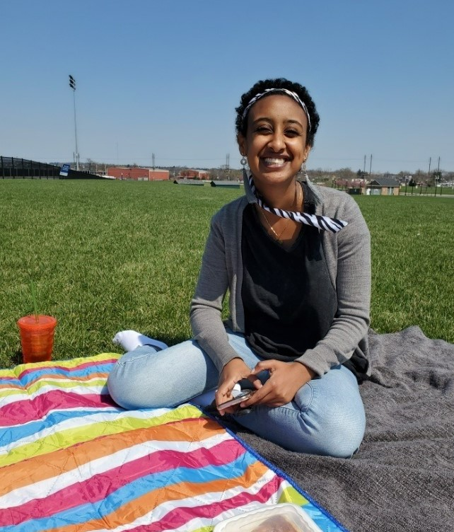

Hello! My name is Hilina. I am currently in Columbia’s Public Health Masters Program. When I was very High School, I attend this Town Hall talk that discussed how medications are created on a bell curve, if there aren’t enough people who have a certain disease, it might not be manufactured even if we have the science to do it. I remember learning so much about what it means to be an advocate for people’s health and the various disparities at play – this was my first time being exposed to Public Health. Since then, I’ve worked at Public Health offices and volunteered with non-profits. 

After getting my degree in Epidemiology with a certificate of Biostatistics, I hope to use the skills that I have learned in both fields to help advocate for people’s health. One of the ways I would like to do that is by being a Data Scientist in a needed Epidemiology field. 

[about](about.html)

[dashboard](dashboard.html)

